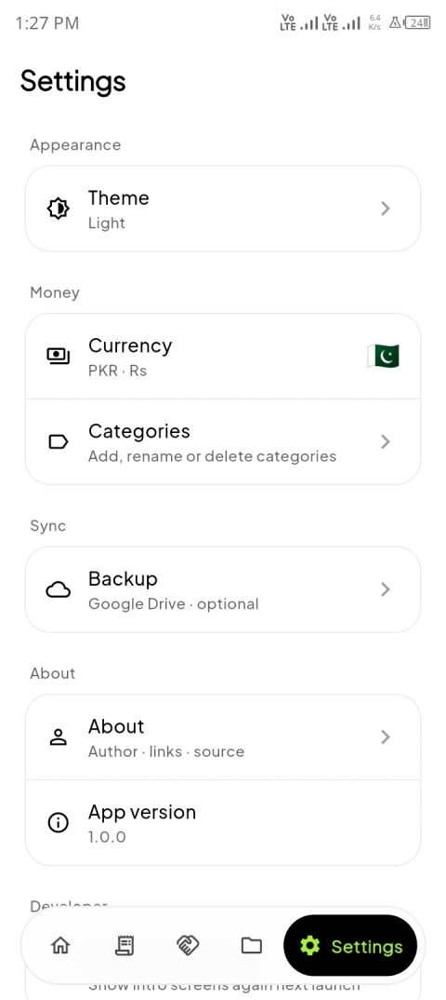
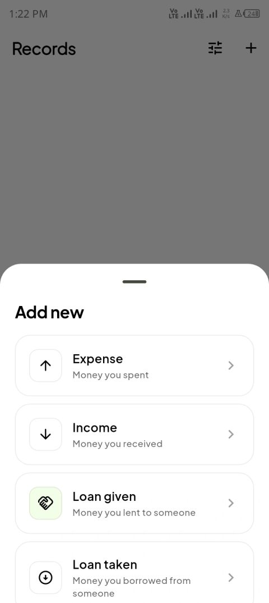
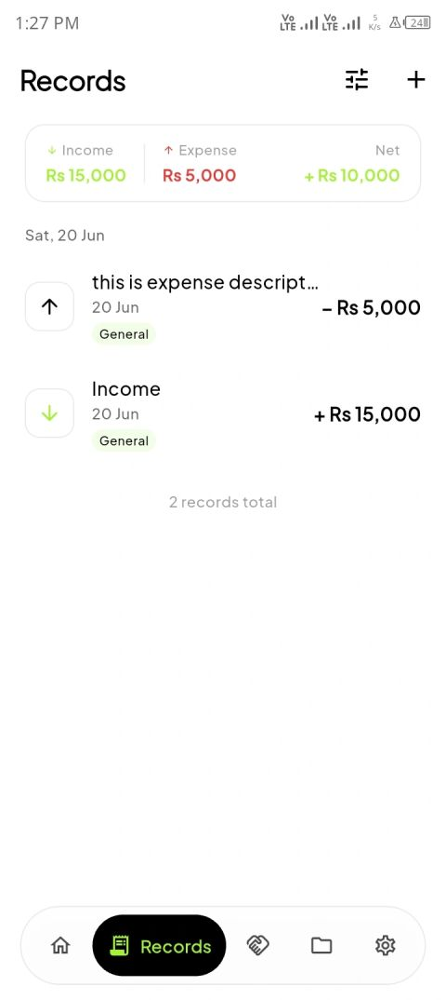
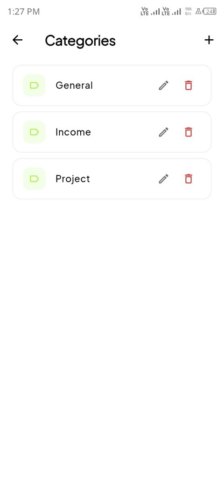
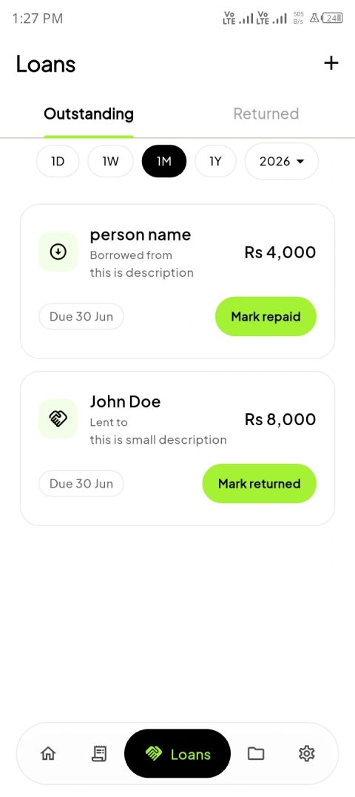
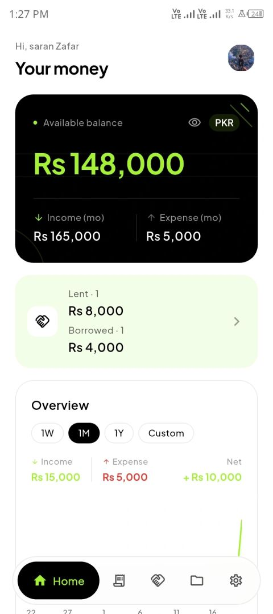
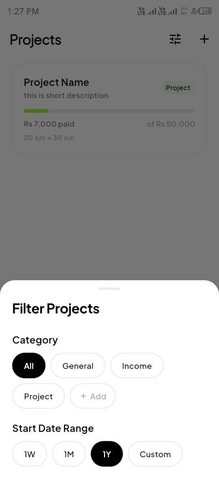

# Xpense Tracker

A clean, offline-first personal finance app for Android. Track expenses, income, loans, and projects — with optional, private Google Drive backup.

<p align="center">
  
  
  
  
  
  
  
</p>

## Download

**[⬇ Download v1.0.2 — latest release](https://github.com/saranzafar/expense-tracker-flutter-mobile-app/releases/tag/v1.0.2)**

| APK | Architecture | Size |
|-----|-------------|------|
| [`app-arm64-v8a-release.apk`](https://github.com/saranzafar/expense-tracker-flutter-mobile-app/releases/download/v1.0.2/app-arm64-v8a-release.apk) | 64-bit · recommended (~95 % of devices) | 21.6 MB |
| [`app-armeabi-v7a-release.apk`](https://github.com/saranzafar/expense-tracker-flutter-mobile-app/releases/download/v1.0.2/app-armeabi-v7a-release.apk) | 32-bit legacy | 19.1 MB |
| [`app-x86_64-release.apk`](https://github.com/saranzafar/expense-tracker-flutter-mobile-app/releases/download/v1.0.2/app-x86_64-release.apk) | x86 / emulators | 23.2 MB |

Enable **"Install from unknown sources"** on your device, then open the APK. The app works fully offline — Google Sign-In is optional and only needed for Drive backup.

---

## Features

### Records
- Four record types: **expense**, **income**, **loan given**, **loan taken**
- Swipe to delete with confirmation dialog
- Infinite-scroll pagination (50 records per page)
- Category badges on each record tile

### Categories
- Shared category pool across income and expense records
- Create, rename, and delete categories from Settings → Categories
- Category-based filtering on the Records page

### Home Dashboard
- Balance card with hide/show toggle (persisted across restarts)
- Monthly income and expense mini-stats
- **Overview chart** — income vs expense line chart with 1W / 1M / 1Y and **custom date range** picker
- Income, expense and net totals for the active chart period
- Outstanding loans and borrowed-money summary card

### Loans
- Track money lent to others and money borrowed from others
- Mark as returned / repaid; history preserved in Returned tab
- Filter by date range

### Projects
- Create projects with name, description, start/end dates, total budget, advance payment, and category
- Vertical payment timeline — tap to add further payments at any time
- **Payments count as income** — the advance and every later payment flow straight into your available balance and appear in Recent Activity (recorded as income, tagged with the project name)
- Filter by category and date range

### Finance Summary
- Records page shows income / expense / net totals for the current filter — updates live as filters change

### Xpy — your money companion
- A **fully code-drawn pixel cat** (no image assets) that lives on the home screen and is the face of the app
- Mood tracks your month's net — happy when saving, worried when overspending, sleepy when there's nothing to track
- Always alive: breathing, blinking, ear-twitches, yawns, tail-wags, hops and little walks
- Reacts to your money (sparkles on income, a crumb on spend) and to you — **tap to pet** for red hearts and a rotating set of facial expressions

### Design
- Material 3, fully light and dark-mode aware, with tabular figures so numbers never jitter
- Frosted glass floating nav bar with smooth decoupled pill animation
- Soft card depth, uppercase overline section labels, staggered entrance + press feedback
- Smooth motion throughout (fade, size, cross-fade transitions)
- **Pull-to-refresh** on every main tab; 10 currencies, system / light / dark theme toggle

### Backup
- Optional Google Drive backup to a **private app-data folder** (invisible in Drive UI)
- Backs up your **settings too** (currency, theme, display name) — a restore on a new device brings them all back
- Auto-backup on app launch, on reconnect, and when the app is backgrounded (throttled)
- **Conflict-safe** — auto-backup won't overwrite a newer cloud copy made on another device; it prompts you to restore instead
- **Instant restore** — restored data shows immediately, no app restart needed
- Surfaces failed backups so you're never left thinking you're protected when you aren't
- Manual backup / restore from Settings → Backup

---

## Tech Stack

Flutter · Riverpod 2 · Drift (SQLite) · fl_chart · `google_sign_in` · `googleapis` · Material 3

---

## Build from Source

```bash
git clone https://github.com/saranzafar/expense-tracker-flutter-mobile-app.git
cd expense-tracker-flutter-mobile-app
flutter pub get
dart run build_runner build --delete-conflicting-outputs
flutter run
```

For Google Drive backup and release-signing setup, see [SETUP.md](SETUP.md).

---

## Changelog

### [v1.0.2](https://github.com/saranzafar/expense-tracker-flutter-mobile-app/releases/tag/v1.0.2)
- **Meet Xpy** — a code-drawn pixel-cat companion on the home screen. Its mood follows your month's net (saving = happy, overspending = worried, quiet = sleepy); it breathes, blinks, looks around, twitches its ears, yawns, wags, hops and takes little walks on its own; reacts when your balance moves (sparkles for income, red hearts when you pet it); and cycles fun expressions (wink, ^_^, O_O, heart-eyes, star-eyes, tongue, dizzy) each time you tap it
- Home chart: tap the **Income / Expense legend** to hide a line — the chart rescales to the remaining one
- **Loans**: rich filter sheet (type · category · date range) + a Lent / Borrowed / Net summary board
- **Projects**: Budget / Received / Remaining summary board that reacts to the active filter
- **Pull-to-refresh** on Home, Records, Loans and Projects to force-reload if anything ever looks stale
- **Reliable auto-backup**: fixed a launch race so it fires when Google sign-in lands, plus a debounced backup after any edit — the same backup the manual button runs, no extra permissions
- Projects: advance and timeline payments now post as income — they raise your available balance and show in Recent Activity (editing/deleting a project payment stays in sync with its income record, and vice-versa)
- Backup now includes app settings (currency, theme, display name, balance visibility) and restores them too
- Restore is instant — no app restart required — and clears stale `-wal`/`-shm` files so a restored database can't be corrupted by a replayed write-ahead log
- Auto-backup conflict guard: skips (and warns) instead of overwriting a cloud backup that's newer than this device's last upload
- Failed auto-backups are surfaced on the Backup page (network errors treated as transient)
- **UI polish**: tabular figures so numbers don't jitter while animating, softer card depth, uppercase overline section labels, staggered home entrance + press feedback, redesigned record tiles and day-group headers with daily net totals

### [v1.0.1](https://github.com/saranzafar/expense-tracker-flutter-mobile-app/releases/tag/v1.0.1)
- Custom date range picker on the home chart (daily/monthly buckets auto-selected)
- Income / expense / net totals strip on both the home chart card and the Records page
- Projects — budget tracking with vertical payment timeline and category + date filters
- Loan taken record type with its own section in the Loans tab
- Shared categories across all record types with Settings → Categories management
- Infinite-scroll pagination on the Records page (50 records per page)
- Dark mode: chip text, category badge, and card surface colour fixes
- Balance card: dark-gray surface in dark mode (no longer inverts to white)
- Floating nav bar: frosted glass in light mode (white bg, black border, soft shadow); smooth white border in dark mode; green active pill
- Nav bar animation: pill travels directly from source to target tab (400 ms easeInOutCubic) — no intermediate tabs light up; swipe tracks the finger frame-perfectly

### [v1.0.0](https://github.com/saranzafar/expense-tracker-flutter-mobile-app/releases/tag/v1.0.0)
- Initial release: expense, income, loan-given records
- Google Drive backup, 10 currencies, light/dark themes

---

## License

MIT — see [LICENSE](LICENSE).

**Author:** Saran Zafar — [saranzafar.com](https://saranzafar.com) · [GitHub](https://github.com/saranzafar) · [LinkedIn](https://www.linkedin.com/in/saranzafar)
