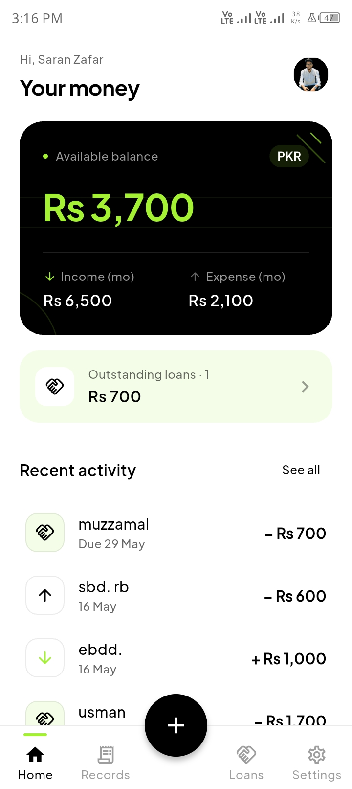
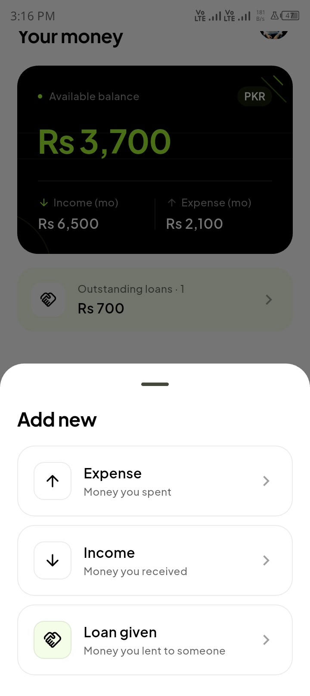
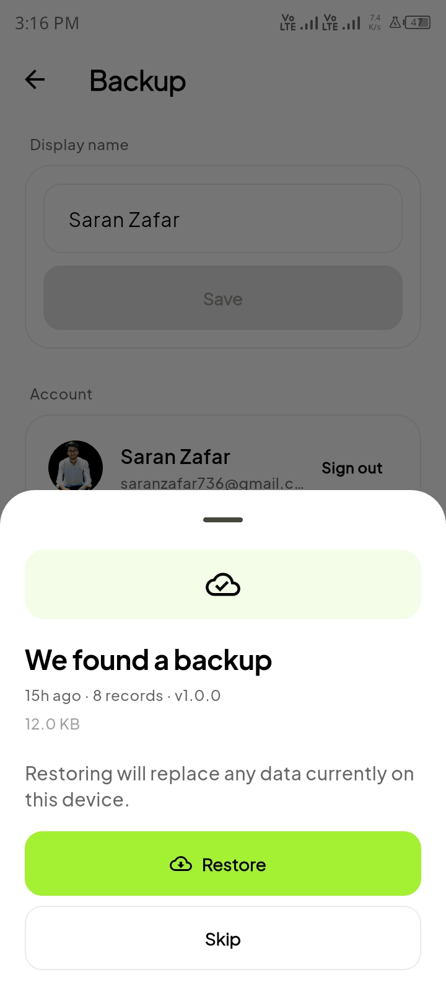

# Xpense Tracker

A clean, offline-first personal finance app for Android. Track expenses, income, loans, and projects — with optional, private Google Drive backup.

<p align="center">
  
  
  
</p>

## Features

### Records
- Four record types: **expense**, **income**, **loan given**, **loan taken**
- Swipe to delete with confirmation dialog
- Infinite-scroll pagination (50 records per page)
- Category badges on each record tile

### Categories
- Shared category pool across income and expense records
- Create, rename, and delete categories from Settings → Categories
- Category-based filtering on the Records page

### Home Dashboard
- Balance card with hide/show toggle (persisted across restarts)
- Monthly income and expense mini-stats
- **Overview chart** — income vs expense line chart with 1W / 1M / 1Y and **custom date range** picker
- Income, expense and net totals for the active chart period
- Outstanding loans and borrowed-money summary card

### Loans
- Track money lent to others and money borrowed from others
- Mark as returned / repaid; history preserved in Returned tab
- Filter by date range

### Projects
- Create projects with name, description, start/end dates, total budget, advance payment, and category
- Vertical payment timeline — tap to add further payments at any time
- Filter by category and date range

### Finance summary strip
- Records page shows income / expense / net totals for the current filter — updates live as filters change

### Design
- Material 3, fully light and dark-mode aware
- Animated floating nav bar with green active-pill indicator
- Smooth motion throughout (fade, size, cross-fade transitions)
- 10 currencies, system / light / dark theme toggle

### Backup
- Optional Google Drive backup to a **private app-data folder** (invisible in Drive UI)
- Auto-backup on reconnect; manual backup from Settings

## Download

Get the APK from the [latest release](https://github.com/saranzafar/expense-tracker-flutter-mobile-app/releases/latest). Enable "Install from unknown sources" and open the file. The app works fully offline; Google Sign-In is optional.

## Tech stack

Flutter · Riverpod 2 · Drift (SQLite) · fl_chart · `google_sign_in` · `googleapis` · Material 3

## Build from source

```bash
git clone https://github.com/saranzafar/expense-tracker-flutter-mobile-app.git
cd expense-tracker-flutter-mobile-app
flutter pub get
dart run build_runner build --delete-conflicting-outputs
flutter run
```

For Google Drive backup and release-signing setup, see [SETUP.md](SETUP.md).

## Changelog

### v1.0.1
- Custom date range picker on the home chart (daily/monthly buckets auto-selected)
- Income / expense / net totals strip on both the home chart card and the Records page
- Projects feature — budget tracking with vertical payment timeline and category + date filters
- Loan taken (borrow) record type with its own Loans tab section
- Shared categories across all record types with Settings → Categories management page
- Infinite-scroll pagination on the Records page (50 records per page)
- Dark mode: chip text, category badge, and card surface colour fixes
- Animated floating nav bar with green active-pill indicator

### v1.0.0
- Initial release: expense, income, loan-given records
- Google Drive backup, 10 currencies, light/dark themes

## License

MIT — see [LICENSE](LICENSE).

**Author:** Saran Zafar — [saranzafar.com](https://saranzafar.com) · [GitHub](https://github.com/saranzafar) · [LinkedIn](https://www.linkedin.com/in/saranzafar)
